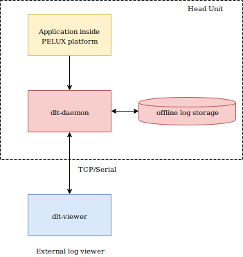
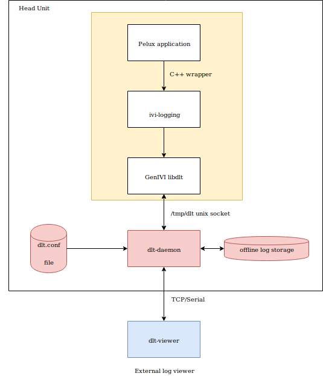

:orphan:

.. _diagnostics-log-and-tracing:

Diagnostics Log and Tracing
===========================

Introduction and goals
----------------------
The Diagnostic, Log and Tracing (DLT) provides a log and trace interface in ECUs. The standardized protocol for logging inside ECU is specified in the AUTOSAR 4.0 DLT, and GENIVI has an open source project `dlt-daemon`_ that follows those standards.

Besides **dlt-daemon**, GENIVI offers `dlt-viewer`_ which is another software that allows a client to connect to the **dlt-daemon** and receive logs remotely.

Since PELUX is GENIVI compliant, we have decided to integrate GENIVIs' DLT component which also works with **dlt-viewer**.

In order to view dlt logs, you can refer to the guide :ref:`view-dlt-logs`. 

Requirements overview
^^^^^^^^^^^^^^^^^^^^^
Log and Trace
"""""""""""""
DLT logs are targeted at OEM-s (developers, testers), since they show technical information and give an overview of the processes. During the development, it is entirely up to the developers to decide what to store on the DLT logs.

On a PELUX image, the **dlt-daemon** package is already integrated and enabled.

In order to get DLT logs remotely, `dlt-viewer`_ is required.

Basic usage
"""""""""""
The **dlt-daemon** runs by default when the PELUX image boots up. **dlt-daemon** usage can be found on https://github.com/GENIVI/dlt-daemon. Cheat-sheets and further documentation can be found on https://github.com/GENIVI/dlt-daemon/tree/master/doc (Although the documentation here is outdated, it can be very helpful giving insight into architecture).

**dlt-daemon** stores offline-log database on /tmp file system.

In order to view the logs via **dlt-viewer**, you need to install it on your machine first. Instructions are available on `the repository`_. Once **dlt-viewer** is built, its binaries are found on build/bin/dlt-viewer and the GUI can be launched via command ./dlt-viewer . You will need to find the IP address of the host, finding the IP address depends on the hardware where PELUX is running.

Optionally, Blue PiraT 2 can be configured to work with **dlt-daemon**, through which multiple gigabytes of logs can be stored.

Basic requirements
""""""""""""""""""
**Unicode support**
PELUX default encoding is UTF-8 for all logging messages. GENIVI **dlt-daemon** works well with UTF-8 as well.

**Dynamic Log adjustments**
The amount of logs, especially in Trace mode, can be overwhelming. Applications that produce DLT logs should have the functionality of enabling/disabling logs or adjusting the level of log outputs. Ideally each logging call should dynamically check boolean condition and just do nothing if logs are dynamically disabled. It will reduce log traffic inside the system and improve performance in general.

GENIVI DLT provides a back channel from **dlt-viewer** to applications that generate DLT logs. The user can precisely change log levels for each application individually from the **dlt-viewer** UI. The user request will reach each application and disable logs in the place they are actually produced.

Quality Goals
"""""""""""""
*Reliability*
Reliability is a key quality for DLT. Developers and testers rely on the logs provided by **dlt-daemon** to find errors and understand behavior of applications. If the logs will be faulty, there will be a very big struggle to debug the error, or understand the behavior.

Stakeholders
^^^^^^^^^^^^
* Software Developers
* QA Engineers

Constraints
-----------
GENIVI's **dlt-daemon** stores an offline log database on in-RAM file system /tmp/dlt_offlinetrace_20120101_005302.dlt. The size limits for the log files should be adjusted at HU startup based on amount of RAM available. E.g. a Premium HU with 16GB of RAM can use 200MB of offline storage. On the other hand, 4GB of ram uses 50MB of offline storage or less.

Solution Strategy
-----------------
DLT logs are automotive industry standard. Industry expects any automotive software to support it. Since PELUX is a part of the open source community, we use a component developed by GENIVI.

Below are the open source software that we use from the DLT component.

* `GENIVI dlt-daemon`_
* `GENIVI dlt-viewer`_

Since GENIVI **dlt-daemon** supports only C applications, another third party software is required to support C++. Currently, PELUX uses `ivi-logging`_.

Building blocks view
--------------------
Level 1
^^^^^^^

Level 2 
^^^^^^^

Design decisions
----------------

In order to integrate the dlt component with PELUX, we needed a wrapper which is capable of handling C++ applications. Currently `ivi-logging`_ is integrated as part of the dlt component. This software was initially developed by Pelagicore but is not actively maintained at this time.

	
Glossary 
--------

+--------+-------------------------------+
| Term   |Definition                     |
+========+===============================+
| DLT    | Diagnostics Log and Tracing   |
+--------+-------------------------------+
| HU     | Head Unit                     |
+--------+-------------------------------+
| ECU    | Electronic Control Unit       |
+--------+-------------------------------+
| TCP    | Transmission Control Protocol |
+--------+-------------------------------+
| GUI    | Graphic user interface        |
+--------+-------------------------------+

.. _CAmDltWrapper (GENIVI AudioManager): https://github.com/GENIVI/AudioManager
.. _log4cplus: http://log4cpp.sourceforge.net/
.. _ivi-logging: https://github.com/pelagicore/ivi-logging
.. _GENIVI dlt-viewer: https://github.com/GENIVI/dlt-viewer
.. _GENIVI dlt-daemon: https://github.com/GENIVI/dlt-daemon
.. _the repository: https://github.com/GENIVI/dlt-viewer
.. _dlt-daemon: https://github.com/GENIVI/dlt-daemon
.. _dlt-viewer: https://github.com/GENIVI/dlt-viewer
