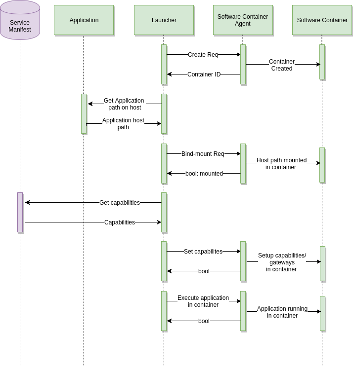

:orphan:

.. _software-container:

Software Container
==================

Introduction and goals
----------------------

The Software Container is a framework that manages and contains applications created
and vetted by third party developers in an automotive setting. A launcher 
(a UI for example) sends a signal to the Software Container to start a new 
Container. It can then configure the Container using a documented JSON format and 
can launch processes inside the Container. This can then be used to isolate 
applications from each other and make sure they are not interfering with each 
other and to limit/manage resources available to the applications.

Each container is configured using gateways, where each gateway has a scope of 
influence (e.g. network, dbus, files, pulseaudio). The gateways get a 
configuration snippet from the Launcher which they will enforce.

Requirements overview
^^^^^^^^^^^^^^^^^^^^^

Basic usage
"""""""""""

- SoftwareContainerAgent component is started at the PELUX boot-up
- An application launcher is used to launch applications in containerized form 
  using the d-bus interface provided by the SoftwareContainerAgent. In PELUX 
  QtApplicationManager is used to launch Neptune3 applications in container

Basic requirements
""""""""""""""""""

SoftwareContainerAgent should provide mechanisms,

- To create container
- To bind-mount file system paths
- To enable communication between the contained system and the host system in 
  order to access host system environment, services and resources, for e.g.

+-----------------------+
| File System           |
+-----------------------+
| Devices               |
+-----------------------+
| Environment variables |
+-----------------------+
| D-Bus                 |
+-----------------------+
| Internet Connectivity |
+-----------------------+
| cgroups               |
+-----------------------+

- To destroy container

Quality goals
^^^^^^^^^^^^^

The main quality goal for the Software Container is to create a sandbox for 
applications/processes in a way that the applications inside the container can 
only access the host system's environment, services and resources through the 
configured capabilities/gateways.

Stakeholders
^^^^^^^^^^^^

- Software Developer
- Platform Integrator

System context
--------------

Business context
^^^^^^^^^^^^^^^^

Within automotive software, it may be desirable in some cases to utilize a single 
ECU for several functions, e.g. it would be beneficial to use the same ECU 
for Telematics and Infotainment functions, rather than having separate under-utilized 
ECUs for each. However, applications within these functions can have different 
resource requirements as well as different levels of importance/priorities, therefore 
it is important to have mechanisms to separate them in a way that they do not 
interfere with each other. This can be achieved through the use of Software Container 
which achieves this in the following ways.

Application Isolation
"""""""""""""""""""""
Separate applications so they run in their own namespace with their own isolated file 
system as well as processes that are isolated from the processes on the host system or 
in other containers. The only communication between, host and containerized systems 
should be through restricted access mechanisms.

Resource limitation
"""""""""""""""""""
Allow applications to have maximum limits set on resources such as memory and CPU 
share. This will allow more important applications to not starve for memory and CPU, 
in case a less important application starts hogging the memory or CPU resources.

Solution strategy
-----------------

In PELUX, the containerization is implemented using,

- Qt Application Manager as a launcher that initiates creation, setup and execution 
  of applications inside Software Container
- Software Container Plugin for Qt Application Manager, that implements the 
  communications between Qt Application Manager and the SoftwareContainerAgent. 
  This plugin is also responsible for mapping applications and their capabilities 
  defined in Service Manifest
- SoftwareContainerAgent which exposes a d-bus API which is used by the Software 
  Container Plugin to request creation, setup and execution of containerized 
  applications. The SoftwareContainerAgent is built on top of the Linux Container 
  solution LXC

Building blocks view
--------------------

Software Container Agent
^^^^^^^^^^^^^^^^^^^^^^^^

Software Container has been designed as a building block enabling sandboxing of 
application contents in a larger system. The Software Container achieves this by 
providing a structured way to limit what inter-process communication (IPC) mechanisms 
are made available to each application. By targeting the IPC mechanisms rather than 
the applications or services directly, the sandboxing mechanism can be deployed in a 
non-intrusive way, i.e. completely transparent to both applications and services. Each 
IPC is managed by a gateway. The IPC needs of each service is described in service 
manifest files, defining capabilities and mapping these to individual gateway 
configurations. This can be individual objects or interfaces on D-Bus, networking 
filter rules, access to device nodes or something completely different. Each 
application is then associated with a set of capabilities. This could be done through 
an application manifest, or any other method supported by the launcher. These are used 
to configure the sandbox in which the application is then launched.

In a typical deployment the Software Container is coupled with a launcher, which is 
responsible for initiating containers and provide an entry point to start execution 
from. This means that Software Container is not intended to be used as a standalone 
tool, but rather as a toolbox to build the full experience from. The launcher is 
responsible for providing Software Container with a list of capabilities, a mount point 
for the application payload and an entry point to start execution from. The Software 
Container does not concern itself with application packaging, deployment of manifest 
formats. All it does is associate the given capabilities with gateway configurations 
to set up the sandbox with the appropriate IPC access to the surrounding world.

The Launcher
^^^^^^^^^^^^

The launcher is responsible for setting up sandboxes for contained applications and then 
launch the application entry point.

The SoftwareContainer API allows the launcher great control over the creation of the 
container. This makes it possible to implement pre-loading schemes, doing much of the 
sandbox creation and configuration prior to actually loading an application.

The setup of a container is done in four phases:

- **Creation**, where the container sandbox is instantiated. This sandbox has no access 
  to the host platform.
- **Activation**, where the sandbox is given a set of capabilities and the gateways are 
  configured accordingly.
- **Mounting**, where the application contents is mounted into the file system of the sandbox.
- **Launching**, where the application entry point is executed.

The main launcher for SoftwareContainer is a part of the `QtApplicationManager`_

.. _QtApplicationManager: http://code.qt.io/cgit/qt/qtapplicationmanager.git/

Service Manifests
^^^^^^^^^^^^^^^^^

Service manifests are JSON files mapping capabilities to gateway configurations. Capabilities 
is what applications specify when they want access to a specific feature of the platform. By 
specifying a list of capabilities to SoftwareContainer, a sandbox with the correct gateway 
configurations is created, providing access to the selected parts of the platform services.

Capabilities are named according to a reverse DNS scheme, e.g. org.genivi.dlt or 
com.pelagicore.popups. In some cases, the same service provides capabilities of different 
levels, e.g. generic permission to show popup compared to permission to show high priority 
popups. This is generally added to the end of the name, e.g. com.pelagicore.popups and 
com.pelagicore.popups.important.

The service manifests are typically placed in one JSON file per service, but can be split into 
one file per capability if needed.

For more detailed information about service manifests content and format see `Service manifests`_

.. _Service manifests: https://pelagicore.github.io/softwarecontainer/user-docs/chapters/service-manifests/index.html#service-manifests

Runtime view
------------

Glossary 
--------

+--------+-------------------------------+
| Term   | Definition                    |
+========+===============================+
| ECU    | Electronic Control Unit       |
+--------+-------------------------------+
| LXC    | Linux Containers              |
+--------+-------------------------------+
| IPC    | Inter Process Communication   |
+--------+-------------------------------+

